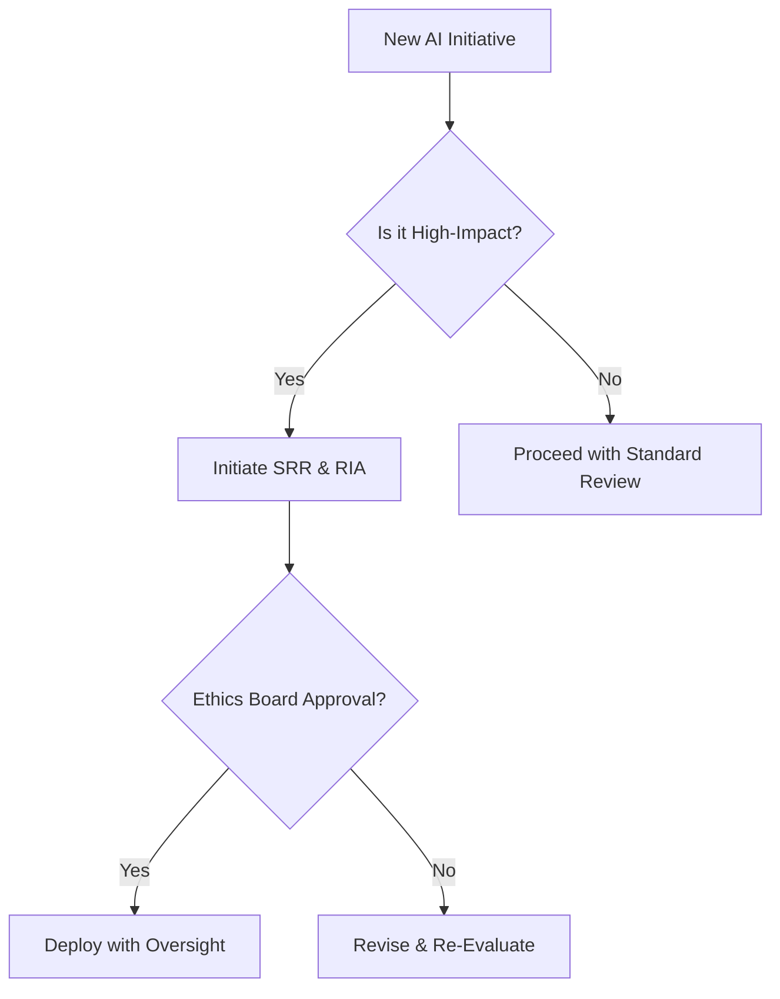

# Ethical AI Governance Framework

## Introduction
This framework defines the core ethical principles and operational protocols for the responsible development and deployment of advanced AI systems, especially in the context of approaching the technological singularity.

## Core Pillars

### 1. Transparency
- All system behaviors, including decision logic and data provenance, must be traceable and auditable.
- Use of explainable AI (XAI) techniques is mandatory for high-impact systems.
- Public access to non-sensitive technical documentation.

### 2. Accountability
- A clear chain of responsibility must exist from model training to deployment.
- Every AI system must have a designated steward accountable for its outcomes.
- Legal and organizational mechanisms must support redress and correction.

### 3. Fairness
- Proactive bias detection and mitigation across all stages of AI lifecycle.
- Regular fairness audits using diverse evaluation datasets.
- Inclusive design processes involving underrepresented communities.

### 4. Human-Centric Design
- AI must support and enhance human agency, not diminish it.
- Systems should provide meaningful human oversight and intervention points.
- Prioritize augmentation over automation in high-stakes domains.

## Operational Protocols

### Pre-Deployment
- Conduct a **Singularity Readiness Review (SRR)**
- Perform a **Risk Impact Assessment (RIA)**
- Obtain **Ethical Sign-Off** from a cross-functional ethics board

### Post-Deployment
- Implement **Continuous Ethical Monitoring (CEM)**
- Establish **Feedback Loops** with users and stakeholders
- Trigger **Escalation Protocols** if ethical thresholds are breached

## Compliance & Governance
- All development teams must follow this framework.
- Annual audits by independent third parties.
- Public reporting of compliance status.

## Appendix: Decision Flowchart
